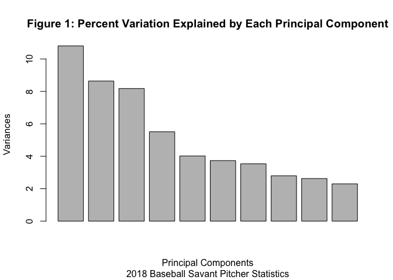

An Analysis of Two Major Advanced Baseball Statistics Websites:
FanGraphs versus Baseball Savant
================
Alex Rados
4/30/2020

# Abstract

In this presentation, I will aim to answer the question of who’s
advanced statistics are more reliable in predicting a players’ future
performance, FanGraph’s or Baseball Savant’s. To measure an individual
player’s performance, I will use the oft-criticized and misunderstood
wins above replacement, or WAR, of the player in the following season.
The process of such a challenge is pulling a variety of variables from
each website (anywhere between 45 to 80 variables, depending on the
website, year, and position) and building a principal components
analysis (PCA) from the data at hand. I will then use these principal
components in a random forest model and attempt to build the most
accurate predictive model for future player performance using
root-mean-square error (RMSE) as the measuring stick. After doing so, I
found that FanGraph’s advanced statistics consistently predicted future
player WAR for both hitters and pitchers each year, with Baseball Savant
closely behind. However, neither was perfect and only addresses the idea
that even with the influx of data, predicting future performance is
still extremely difficult.

# Introduction

The release of “Moneyball” in 2003 and the unexpected dominance of the
Oakland Athletics, a cash-strapped team who exchanged World Series
trophies for the bragging rights to being the best team with no budget,
inspired what would become the analytics age in baseball. Over that
time, organizations and fans alike have been collecting data and
creating new statistics like theres no tomorrow. Any fan can find these
statistics on the two leading public baseball statistics websites,
FanGraphs and Baseball Savant. These range from reaction time on a fly
ball to time taken in between pitches and include just about every
letter in the alphabet as well as mathematical operations. Baseball has
long been known for its statistics and box scores, but in today’s
analytics age, there is data on everything and organization’s are behind
if they aren’t making use of it.

FanGraphs is the elder of the two databases, having tracked players
peripherals and offering more accurate views into a players performance
than basic statistics since 2009. It is the dream website of any human
being that grew up eyes glazed on the back of a baseball card.

Baseball Savant is a newer entrant into the world of advanced statistics
and began to make waves in 2015 with its introduction of Statcast.
Statcast metrics track a variety of different actions, most notably exit
velocity and launch angle, and are seemingly revolutionizing the sport
of evaluating baseball analytics.

Both of these websites provide their fair share of different statistics
that hope to help predict the future. And with the amount of data
available on them for any individual player, there are surely answers to
the age old questions of how the 29 year old left-handed starter who
struck out 200 batters will fare next season or if the super-utility
role player that broke out for 30 home runs will experience similar
success next year. Most importantly, for those who dare traverse into
baseball analytics, it just provides more and more information.

Being able to know which statistics to use and how to use them is the
most pressing issue at hand. There are many analysts out there that can
bang the table for a player being good or bad using their fair share of
statistics, and in the end, only one will be right. Knowing which set to
use is thus the starting point for being on the correct side of the
argument, whether you’re the general manager of a team prepared to offer
a $400 million contract to a star player or a recent college graduate
trying to build a case for why they should be hired by the team. No
matter what, knowing whether FanGraphs or Baseball Savant, or in the
future when Baseball Smarticus or any other website is created and
promoting their own fancy analytics database, is the best predictor of
future performance is the first step to building a legitimate career in
the sport of baseball.

# Methods

There are sixteen unique datasets that I’ll be focusing on for this
report. For each year covered, there’ll be four different sets, two for
each website (FanGraphs and Baseball Savant) addressing hitters and
pitchers, seperately. I will be looking at each year from 2015 until
2018, using player statistics from their respective years and trying to
predict their performance in the following season (thus, the outfielder
Mike Trout’s 2015 statistical season will be used to predict his WAR in
2016). I only go back as far as 2015 as that is when the statcast data
becomes available from Baseball Savant.

For each website and year, I limit the player pool to those who have
recorded 200 plate appearances, by definition of the website. For
hitters, this means stepping up to bat at least 200 times in a season.
For pitchers, this amounts to around 40 innings pitched, thus allowing
both relievers and starters be included. This also limits the
notoriously small sample that at times plagues evaluation of players in
baseball.

There are different amounts of variables for each database, even varying
by year. For hitters within FanGraphs’ database, there are 68 available
features from which to pull from staying the same each year, ranging
from strikeout-to-walk rates (K/BB) to weighted runs created plus (wRC+,
how good of a hitter a player is factoring in ballparks, team, and other
variables that may differ among batters). For the pitchers, after
removing the extraneous statistics pulled in, there are 73 variables
used for each year.

For Baseball Savant, the variables stay relatively similar for the
hitters, only adding in homeplate-to-first-base speed for 2017 and 2018.
Thus, for 2015 and 2016 there are a total of 44 features while for 2017
and 2018 it jumps to 45. For pitchers, on the otherhand, there is a
massive difference between the 2015-2016 datasets and the 2017-2018
datasets. 2015 and 2016 only include 51 variables while 2017 and 2018
total 73 variables each.

The reasoning behind this is in 2017, Baseball Savant began evaluating
each singluar pitch and recording its velocity, break, and spin rate.
This was seen as a major breakthrough in advanced analytics, allowing
those interested enough to see what really affects a hitters ability to
make contact with a pitch. This can lead to more informative coaching
and scouting throughout the league, allowing those in charge and those
desiring for such positions to take advantage of even more data. And,
within the paper, this could theoretically lead to Baseball Savant being
a more accurate predictor of future performance of pitchers, but more on
that later.

With each unique dataset, I run a principle component analysis on the
variables provided by both FanGraphs and Baseball Savant. Considering
the large amount of statistics available, along with some variables
being used as inputs for other variables (strikeout rates having a
massive impact on one’s fielding independent pitching, for example), PCA
would be a smart way to deciphering the most important aspects of each
variable while also not having an issue with correlation throughout.

Running principal component analysis on each of these datasets (thus, a
total of 16 times) results in anywhere from 44 to 71 principal
components that explain 100% of the variation within the problem. The
dataset in which principal component one explains the most amount of
variance is the FanGraph’s pitchers database which consistently explains
around 33% of the variation in player WAR. The lowest, and most spread
out among its principal components, is the 2017 and 2018 Baseball Savant
analyses, as seen in Figure 1.
<!-- -->

This is most likely due to the introduction of the new statistics on
pitch tracking, thus spreading around the effect that each variable has
on a player’s future performance.

I whittle down each of these datasets to the number of PC’s that provide
the best predictive performance when computing the random forests later,
resulting in a minimum of 5 PCs (2017 Fangraph’s hitters) to 25 PCs
(2016 Baseball Savant’s hitters) used, depending on how low the RMSE is
in my future analysis.

# Results

# Conclusion
