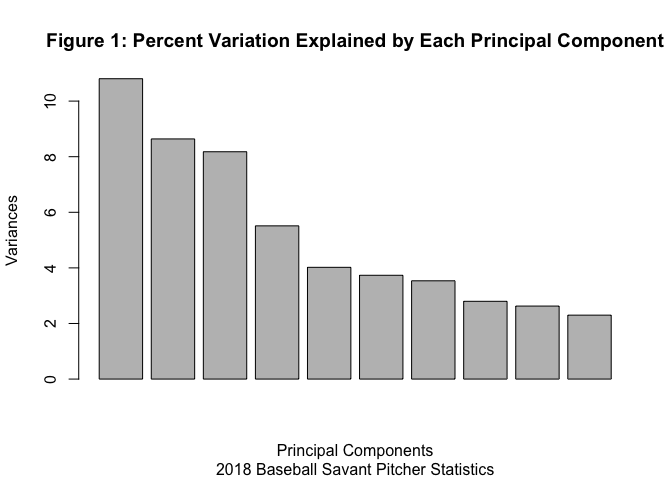
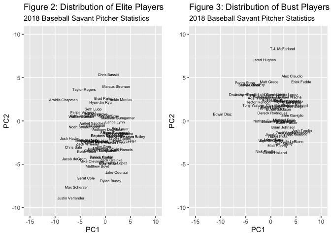
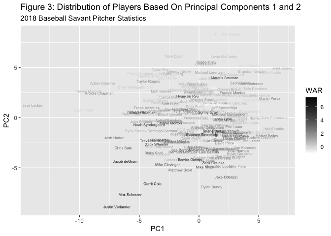

An Analysis of Two Major Advanced Baseball Statistics Websites:
FanGraphs versus Baseball Savant
================
Alex Rados
4/30/2020

# Abstract

In this presentation, I will aim to answer the question of who’s
advanced statistics are more reliable in predicting a players’ future
performance, FanGraph’s or Baseball Savant’s. To measure an individual
player’s performance, I will use the oft-criticized and misunderstood
wins above replacement, or WAR, of the player in the following season.
The process of such a challenge is pulling a variety of variables from
each website (anywhere between 45 to 80 variables, depending on the
website, year, and position) and building a principal components
analysis (PCA) from the data at hand. I will then use these principal
components in a random forest model and attempt to build the most
accurate predictive model for future player performance using
root-mean-square error (RMSE) as the measuring stick. After doing so, I
found that FanGraph’s advanced statistics consistently predicted future
player WAR for both hitters and pitchers each year, with Baseball Savant
closely behind. However, neither was perfect and only addresses the idea
that even with the influx of data, predicting future performance is
still extremely difficult.

# Introduction

The release of “Moneyball” in 2003 and the unexpected dominance of the
Oakland Athletics, a cash-strapped team who exchanged World Series
trophies for the bragging rights to being the best team with no budget,
inspired what would become the analytics age in baseball. Over that
time, organizations and fans alike have been collecting data and
creating new statistics like theres no tomorrow. Any fan can find these
statistics on the two leading public baseball statistics websites,
FanGraphs and Baseball Savant. These range from reaction time on a fly
ball to time taken in between pitches and include just about every
letter in the alphabet as well as mathematical operations. Baseball has
long been known for its statistics and box scores, but in today’s
analytics age, there is data on everything and organization’s are behind
if they aren’t making use of it.

FanGraphs is the elder of the two databases, having tracked players
peripherals and offering more accurate views into a players performance
than basic statistics since 2009. It is the dream website of any human
being that grew up eyes glazed on the back of a baseball card.

Baseball Savant is a newer entrant into the world of advanced statistics
and began to make waves in 2015 with its introduction of Statcast.
Statcast metrics track a variety of different actions, most notably exit
velocity and launch angle, and are seemingly revolutionizing the sport
of evaluating baseball analytics.

Both of these websites provide their fair share of different statistics
that hope to help predict the future. And with the amount of data
available on them for any individual player, there are surely answers to
the age old questions of how the 29 year old left-handed starter who
struck out 200 batters will fare next season or if the super-utility
role player that broke out for 30 home runs will experience similar
success next year. Most importantly, for those who dare traverse into
baseball analytics, it just provides more and more information.

Being able to know which statistics to use and how to use them is the
most pressing issue at hand. There are many analysts out there that can
bang the table for a player being good or bad using their fair share of
statistics, and in the end, only one will be right. Knowing which set to
use is thus the starting point for being on the correct side of the
argument, whether you’re the general manager of a team prepared to offer
a $400 million contract to a star player or a recent college graduate
trying to build a case for why they should be hired by the team. No
matter what, knowing whether FanGraphs or Baseball Savant, or in the
future when Baseball Smarticus or any other website is created and
promoting their own fancy analytics database, is the best predictor of
future performance is the first step to building a legitimate career in
the sport of baseball.

# Methods

There are sixteen unique data sets that I’ll be focusing on for this
report. For each year covered, there’ll be four different sets, two for
each website (FanGraphs and Baseball Savant) addressing hitters and
pitchers, seperately. I will be looking at each year from 2015 until
2018, using player statistics from their respective years and trying to
predict their performance in the following season (thus, the outfielder
Mike Trout’s 2015 statistical season will be used to predict his WAR in
2016). I only go back as far as 2015 as that is when the statcast data
becomes available from Baseball Savant.

For each website and year, I limit the player pool to those who have
recorded 200 plate appearances, by definition of the website. For
hitters, this means stepping up to bat at least 200 times in a season.
For pitchers, this amounts to around 40 innings pitched, thus allowing
both relievers and starters to be included. This also limits the
notoriously small sample that at times plagues evaluation of players in
baseball.

There are different amounts of variables for each database, even varying
by year. For hitters within FanGraphs’ database, there are 68 available
features from which to pull from each year, ranging from
strikeout-to-walk rates (K/BB) to weighted runs created plus (wRC+, how
good of a hitter a player is factoring in ballparks, team, and other
variables that may differ among batters). For the pitchers, after
removing the extraneous statistics pulled in, there are 73 variables
used for each year.

For Baseball Savant, the variables stay relatively similar for the
hitters, only adding in homeplate-to-first-base speed for 2017 and 2018.
Thus, for 2015 and 2016 there are a total of 44 features while for 2017
and 2018 it jumps to 45. For pitchers, on the otherhand, there is a
massive difference between the 2015-2016 datasets and the 2017-2018
datasets. 2015 and 2016 only include 51 variables while 2017 and 2018
total 73 variables each.

The reasoning behind this is in 2017, Baseball Savant began evaluating
each singluar pitch and recording its velocity, break, and spin rate.
This was seen as a major breakthrough in advanced analytics, allowing
those interested enough to see what really affects a hitters ability to
make contact with a pitch. This can lead to more informative coaching
and scouting throughout the league, allowing those in charge and those
desiring for such positions to take advantage of even more data. And,
within the paper, this could theoretically lead to Baseball Savant being
a more accurate predictor of future performance of pitchers, but more on
that later.

With each unique data set, I run a principle component analysis on the
variables provided by both FanGraphs and Baseball Savant. Considering
the large amount of statistics available, along with some variables
being used as inputs for other variables (strikeout rates having a
massive impact on one’s fielding independent pitching, for example), PCA
would be a smart way to deciphering the most important aspects of each
variable while also not having an issue with correlation throughout.

Running principal component analysis on each of these data sets (thus, a
total of 16 times) results in anywhere from 44 to 71 principal
components that explain 100% of the variation within the problem. The
data set in which PC1 explains the most amount of variance is the
FanGraph’s pitchers database, which consistently explains around 33% of
the variation in player WAR. The lowest, and most spread out among its
principal components, is the 2017 and 2018 Baseball Savant analyses, as
seen in Figure
1.

<!-- -->

This is most likely due to the introduction of the new statistics on
pitch tracking, thus spreading around the effect that each variable has
on a player’s future performance. An example of how these principal
components have an effect depending on players involved is seen in the
results section in Figure 2.

I whittle down each of these data sets to the number of PC’s that
provide the best predictive performance when computing the random
forests later, resulting in a minimum of 5 PCs (2017 Fangraph’s hitters)
to a maximum of 25 PCs (2016 Baseball Savant’s hitters) used, depending
on how low the RMSE is in my future analysis.

Using the principal components for each data set I then run a random
forest, attempting to predict a player’s wins above replacement in the
following year. In order to generate the most accurate predictions, I
randomly sampled 80% of the data at hand and used that as a training set
on which I built my model while using the other 20% as a test set on
which I tested the model to gather a sufficient RMSE. This then allows
me to measure the out-of-sample performance.

Finally, to address the issue of random variation with the selection of
data points that end up in our train/test split, I ran a do-loop. This
averaged the estimate of out-of-sample RMSEs over 250 different random
train/test splits, to which I felt comfortable with the lack of random
variation in the results that were being generated.

# Results

Below in Figure 2, as addressed earlier, is an example of the pitchers
in the 2018 season being plotted according to how they rated
statistically among the principal components 1 and
2.

<!-- -->

While Figure 2 might be difficult to decipher with all the players’
names overlapping each other, Figure 3 attempts to give a better look
into how the principal components are aimed at divying up future
high-WAR caliber players from the rest. This is done through bolding the
players who performed at a high level the following season while those
who had a poor year fade into the background.

The players to the left of PC1 tend to be more adept pitchers, which is
judged through various statistics. The highest weighted of those is
opponents’ expected slugging percentage, expected weighted on-base
average, and expected isolated power, among other things. Clearly, these
are pitchers that limit players getting on base and limit extra base
hits (doubles, triples, home runs).

PC2 on the otherhand heavily weighs pitchers who throw a lot of innings
(the better you perform, the more innings you’ll be asked to throw),
give up minimal “barrels” (a hit whose comparable hit types have led to
a minimum .500 batting average and 1.500 slugging percentage based on
exit velocity and launch angle), and get a lot of swings and misses on
out-of-the-zone
pitches.

<!-- -->

These figures, along with all of the other principal component graphs
available from evaluating these data sets, won’t ever give a full
picture of a high-performing pitcher in the MLB. However, it does show a
little bit of the grouping of the elite at the position.

Finally, Tables 1 and 2 aim to address the question at hand: which
website’s advanced statistics do a better job of predicting future
performance, FanGraphs or Baseball Savant? Table 1 is strictly for
comparing Fangraphs and Baseball Savant’s predictive power for pitcher
performance throughout the time frame.

<table>

<caption>

Table 1: Root-Mean-Square Error in Predicting Future Pitcher Performance

</caption>

<thead>

<tr>

<th style="text-align:left;">

Year

</th>

<th style="text-align:right;">

FanGraphs

</th>

<th style="text-align:right;">

Baseball.Savant

</th>

</tr>

</thead>

<tbody>

<tr>

<td style="text-align:left;">

2015

</td>

<td style="text-align:right;">

1.256619

</td>

<td style="text-align:right;">

1.276327

</td>

</tr>

<tr>

<td style="text-align:left;">

2016

</td>

<td style="text-align:right;">

1.313601

</td>

<td style="text-align:right;">

1.299582

</td>

</tr>

<tr>

<td style="text-align:left;">

2017

</td>

<td style="text-align:right;">

1.292031

</td>

<td style="text-align:right;">

1.354274

</td>

</tr>

<tr>

<td style="text-align:left;">

2018

</td>

<td style="text-align:right;">

1.329639

</td>

<td style="text-align:right;">

1.464783

</td>

</tr>

</tbody>

</table>

Table 2, on the otherhand, is reserved for comparing the performance of
the two websites’ advanced statistics on predicting future hitters’
performance from 2015-2018.

<table>

<caption>

Table 2: Root-Mean-Square Error in Predicting Future Hitter Performance

</caption>

<thead>

<tr>

<th style="text-align:left;">

Year

</th>

<th style="text-align:right;">

FanGraphs

</th>

<th style="text-align:right;">

Baseball.Savant

</th>

</tr>

</thead>

<tbody>

<tr>

<td style="text-align:left;">

2015

</td>

<td style="text-align:right;">

1.747368

</td>

<td style="text-align:right;">

1.836366

</td>

</tr>

<tr>

<td style="text-align:left;">

2016

</td>

<td style="text-align:right;">

1.684635

</td>

<td style="text-align:right;">

1.811011

</td>

</tr>

<tr>

<td style="text-align:left;">

2017

</td>

<td style="text-align:right;">

1.734408

</td>

<td style="text-align:right;">

1.817095

</td>

</tr>

<tr>

<td style="text-align:left;">

2018

</td>

<td style="text-align:right;">

1.746809

</td>

<td style="text-align:right;">

1.801687

</td>

</tr>

</tbody>

</table>

# Conclusion

As we can see from the two tables, FanGraphs and Baseabll Savant are
generally pretty similar when it comes to accuracy in predicting future
player performance. Each website tends to struggle more with evaluating
hitters than pitchers, displaying the difficulty in gathering good data
on the hitters throughout the league.

From Table 1, we can gather that FanGraphs and Baseball Savant share
equally respectable predictive power when it comes to evaluating future
pitcher performance. From 2015-2016, each website can pride itself on
having done better than its competitor. In my opinion, this wasn’t
shocking given the sheer amount of valuable data Baseball Savant offers
when it comes to pitcher evaluation.

The most surprising part, however, is from 2017-2018, Baseball Savant
crumbles in comparison to FanGraphs’ predictive performance. Keep in
mind, 2017 and 2018 is when Baseball Savant began using data on
individual pitch performance, evaluating spin rates, break, and
velocity. It seems as if this extra data actually has a negative effect
on Baseball Savant’s predictive power, a shocking result from my
understanding of the advanced statistics world.

On the hitter side, FanGraphs and Baseball Savant stay relatively
simmilar in their predictions year over year, aside from a bit of a
decline for FanGraphs in 2016. Regardless, FanGraphs consistently offers
the more accurate predictions for future hitter WAR than Baseball
Savant.

Overall, FanGraphs’ advanced statistics offer more appeal as the most
accurate predictor of future player performance based on the next
season’s WAR. Thus, whether one is a general manager seeking to bid on
a free agent or an aspiring graduate looking for a job in the field,
those working in baseball analytics should start with the industry
standard: FanGraphs.
